# WebWallpaper

Display web content as desktop wallpaper on Windows, Linux and macOS.

A cross-platform Rust CLI tool that renders web pages (URLs or local HTML files) as fullscreen desktop wallpaper with multi-monitor support.

---

**[English](#english)** | **[中文](#中文)**

---

## Preview / 预览

<div align="center">

Wallpaper demonstraition : **ascend** by [bug](https://www.shadertoy.com/view/33KBDm)

https://github.com/ownself/webwallpaper/raw/main/previews/ascend.mp4

</div>

<table>
<tr>
<td align="center"><a href="https://www.shadertoy.com/view/4tdSWr">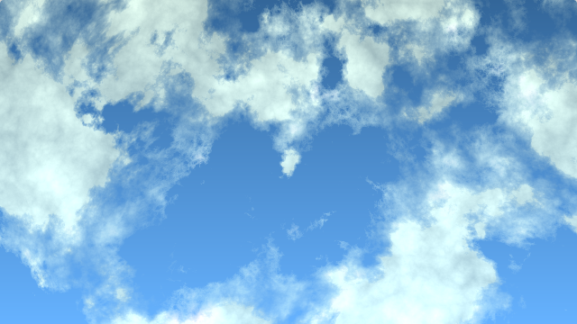</a><br><b>2dclouds</b><br><sub>by <a href="https://www.shadertoy.com/view/4tdSWr">drift</a></sub></td>
<td align="center"><a href="https://www.shadertoy.com/view/WcKXDV">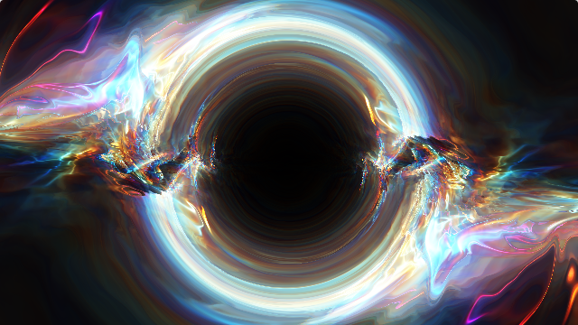</a><br><b>accretion</b><br><sub>by <a href="https://www.shadertoy.com/view/WcKXDV">Xor</a></sub></td>
<td align="center"><a href="https://www.shadertoy.com/view/33KBDm">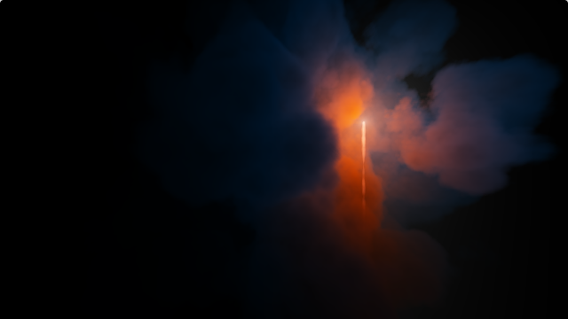</a><br><b>ascend</b><br><sub>by <a href="https://www.shadertoy.com/view/33KBDm">bug</a></sub></td>
<td align="center"><a href="https://www.shadertoy.com/view/XtGGRt">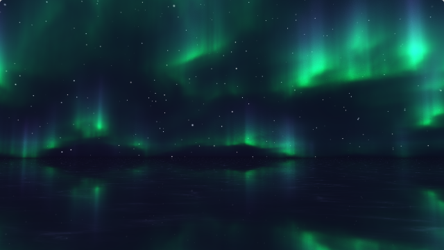</a><br><b>auroras</b><br><sub>by <a href="https://www.shadertoy.com/view/XtGGRt">nimitz</a></sub></td>
</tr>
<tr>
<td align="center"><a href="https://www.shadertoy.com/view/3XSBDW">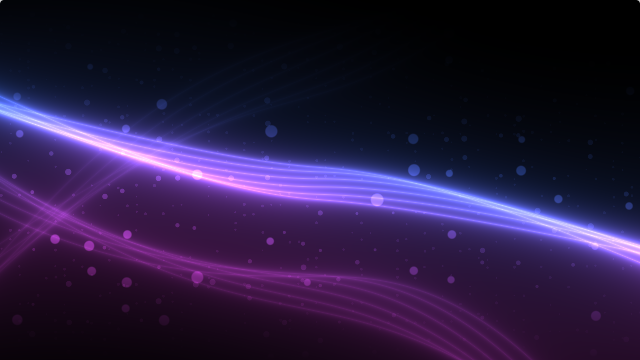</a><br><b>chillywave</b><br><sub>by <a href="https://www.shadertoy.com/view/3XSBDW">Tornax07</a></sub></td>
<td align="center"><a href="https://www.shadertoy.com/view/NflGRM"></a><br><b>chillywave2</b><br><sub>by <a href="https://www.shadertoy.com/view/NflGRM">Tornax07</a></sub></td>
<td align="center"><a href="https://www.shadertoy.com/view/W3K3zy">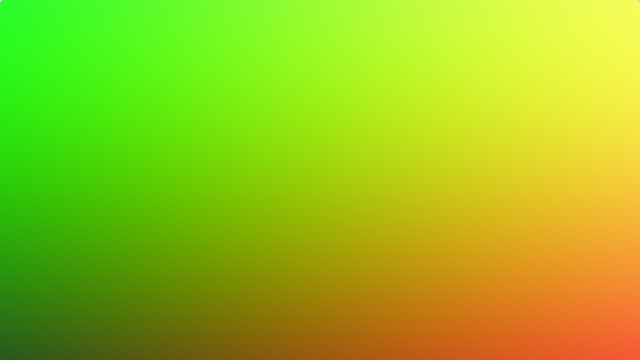</a><br><b>classic4colors</b><br><sub>by <a href="https://www.shadertoy.com/view/W3K3zy">zosxavius</a></sub></td>
<td align="center"><a href="https://www.shadertoy.com/view/XslGRr"></a><br><b>clouds</b><br><sub>by <a href="https://www.shadertoy.com/view/XslGRr">iq</a></sub></td>
</tr>
<tr>
<td align="center"><a href="https://www.shadertoy.com/view/3ttSzr">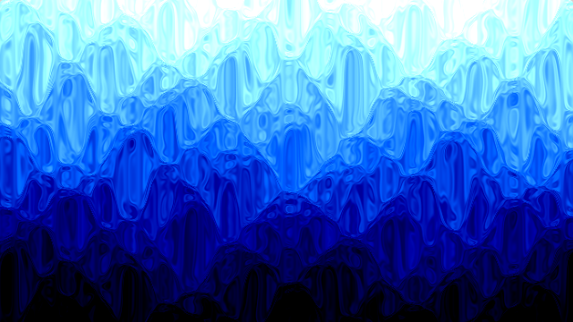</a><br><b>crumpledwave</b><br><sub>by <a href="https://www.shadertoy.com/view/3ttSzr">nasana</a></sub></td>
<td align="center"><a href="https://www.shadertoy.com/view/WcdczB">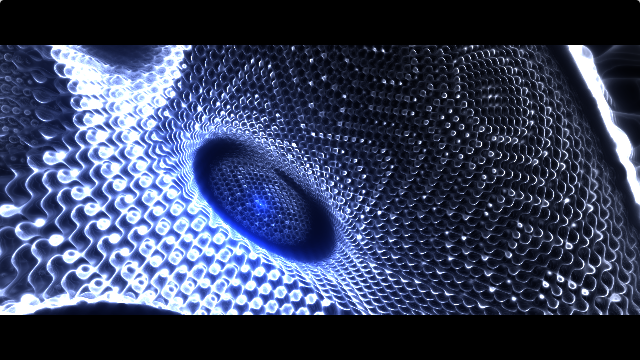</a><br><b>darktransit</b><br><sub>by <a href="https://www.shadertoy.com/view/WcdczB">diatribes</a></sub></td>
<td align="center"><a href="https://www.shadertoy.com/view/Dds3WB">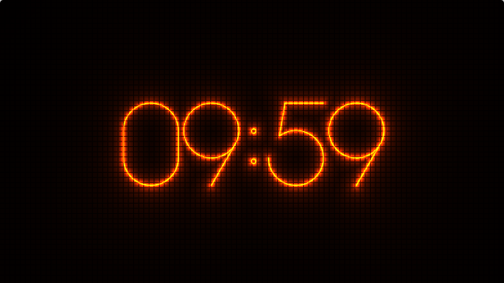</a><br><b>forknixietubeclock</b><br><sub>by <a href="https://www.shadertoy.com/view/Dds3WB">picoplanetdev</a></sub></td>
<td align="center"><a href="https://www.shadertoy.com/view/WtSfWK">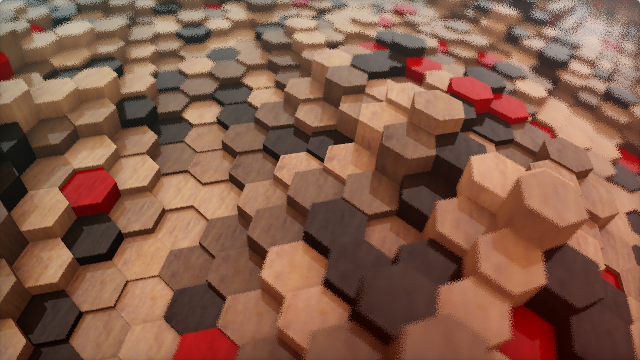</a><br><b>hexagonalgrid</b><br><sub>by <a href="https://www.shadertoy.com/view/WtSfWK">iq</a></sub></td>
</tr>
<tr>
<td align="center"><a href="https://www.shadertoy.com/view/3tKSWV">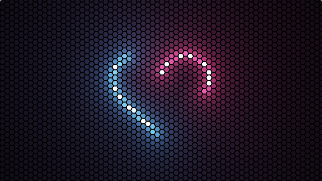</a><br><b>hexneonlove</b><br><sub>by <a href="https://www.shadertoy.com/view/3tKSWV">tutmann</a></sub></td>
<td align="center"><a href="https://www.shadertoy.com/view/Nff3Ds">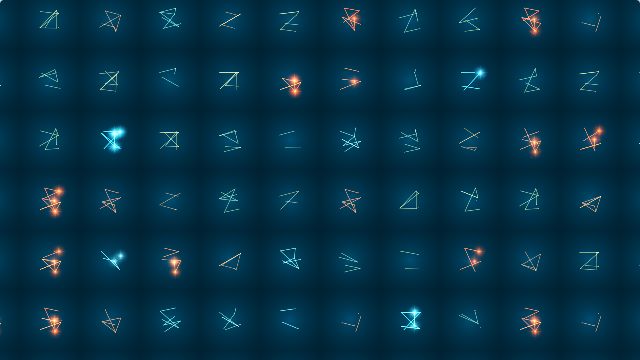</a><br><b>hieroglyphs</b><br><sub>by <a href="https://www.shadertoy.com/view/Nff3Ds">nayk</a></sub></td>
<td align="center"><a href="https://www.shadertoy.com/view/MdfBzl">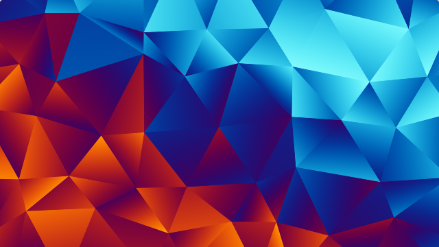</a><br><b>iceandfire</b><br><sub>by <a href="https://www.shadertoy.com/view/MdfBzl">mattz</a></sub></td>
<td align="center"><a href="https://www.shadertoy.com/view/4dcGRn">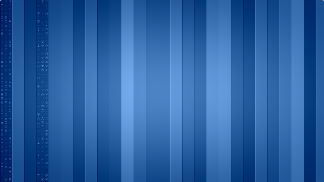</a><br><b>linuxwallpaper</b><br><sub>by <a href="https://www.shadertoy.com/view/4dcGRn">movAX13h</a></sub></td>
</tr>
<tr>
<td align="center"><a href="https://www.shadertoy.com/view/NlcSRj">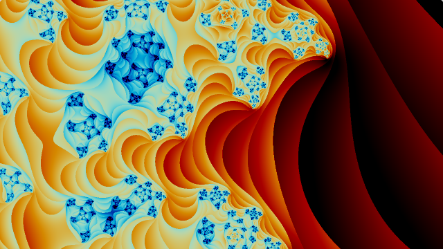</a><br><b>mandelbrot</b><br><sub>by <a href="https://www.shadertoy.com/view/NlcSRj">JennySchub</a></sub></td>
<td align="center"><a href="https://www.shadertoy.com/view/NdVfzK">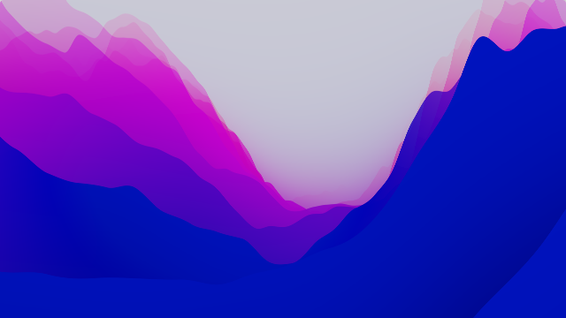</a><br><b>montereywannabe</b><br><sub>by <a href="https://www.shadertoy.com/view/NdVfzK">mrange</a></sub></td>
<td align="center"><a href="https://www.shadertoy.com/view/sfS3Dz">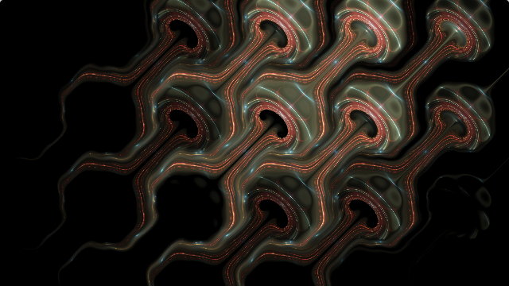</a><br><b>patternminimax</b><br><sub>by <a href="https://www.shadertoy.com/view/sfS3Dz">PAEz</a></sub></td>
<td align="center"><a href="https://www.shadertoy.com/view/ddKXWh">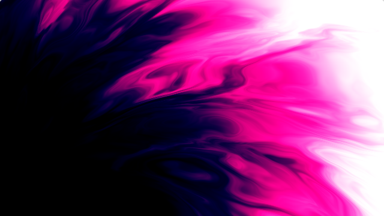</a><br><b>pinkvoid</b><br><sub>by <a href="https://www.shadertoy.com/view/ddKXWh">iVader</a></sub></td>
</tr>
<tr>
<td align="center"><a href="https://www.shadertoy.com/view/WfS3Dd">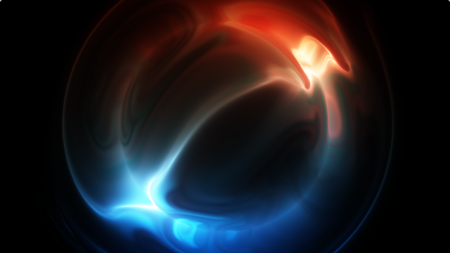</a><br><b>plasma</b><br><sub>by <a href="https://www.shadertoy.com/view/WfS3Dd">Xor</a></sub></td>
<td align="center"><a href="https://www.shadertoy.com/view/ltXczj">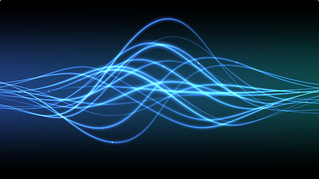</a><br><b>plasmawaves</b><br><sub>by <a href="https://www.shadertoy.com/view/ltXczj">scarletshark</a></sub></td>
<td align="center"><a href="https://www.shadertoy.com/view/sc2GzW">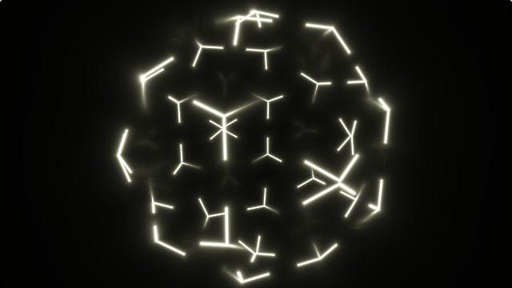</a><br><b>polyhedrons</b><br><sub>by <a href="https://www.shadertoy.com/view/sc2GzW">yli110</a></sub></td>
<td align="center"><a href="https://www.shadertoy.com/view/3l23Rh">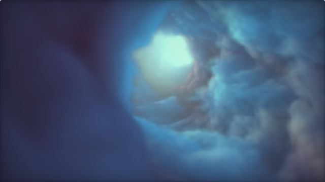</a><br><b>proteanclouds</b><br><sub>by <a href="https://www.shadertoy.com/view/3l23Rh">nimitz</a></sub></td>
</tr>
<tr>
<td align="center"><a href="https://www.shadertoy.com/view/fcf3Dn">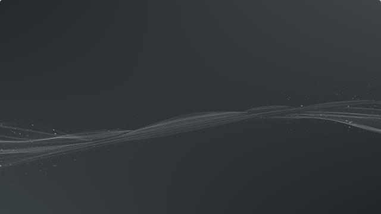</a><br><b>ps3xmb</b><br><sub>by <a href="https://www.shadertoy.com/view/fcf3Dn">llmciv</a></sub></td>
<td align="center"><a href="https://www.shadertoy.com/view/XsX3zl">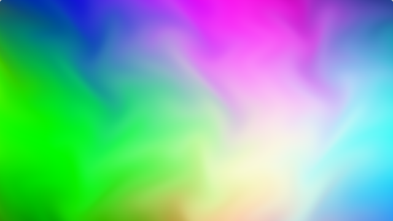</a><br><b>seventymelt</b><br><sub>by <a href="https://www.shadertoy.com/view/XsX3zl">tomorrowevening</a></sub></td>
<td align="center"><a href="https://www.shadertoy.com/view/3csSWB">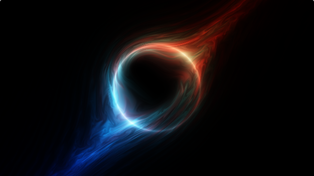</a><br><b>singularity</b><br><sub>by <a href="https://www.shadertoy.com/view/3csSWB">Xor</a></sub></td>
<td align="center"><a href="https://www.shadertoy.com/view/wsBBWD">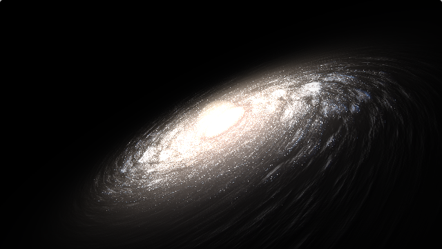</a><br><b>spiralgalaxy</b><br><sub>by <a href="https://www.shadertoy.com/view/wsBBWD">mrange</a></sub></td>
</tr>
<tr>
<td align="center"><a href="https://www.shadertoy.com/view/XlfGRj">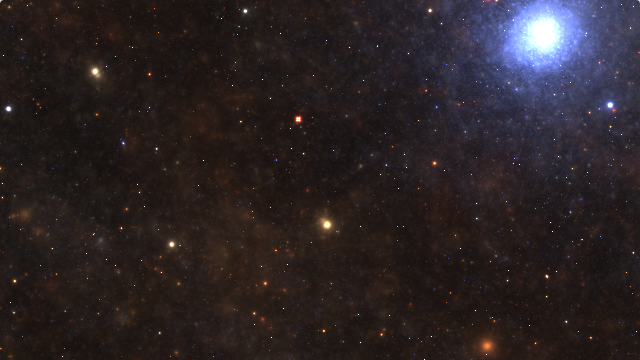</a><br><b>starnest</b><br><sub>by <a href="https://www.shadertoy.com/view/XlfGRj">Kali</a></sub></td>
<td align="center"><a href="https://www.shadertoy.com/view/XX3fDH">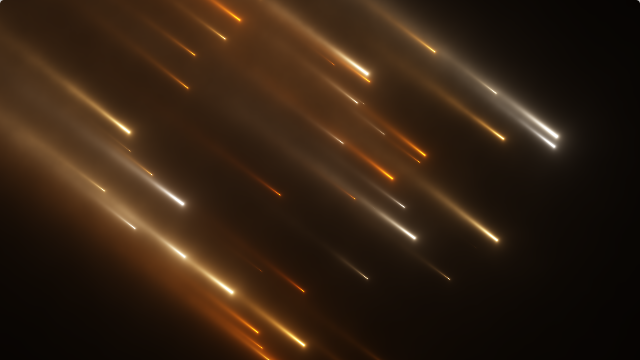</a><br><b>starshipreentry</b><br><sub>by <a href="https://www.shadertoy.com/view/XX3fDH">negentrope</a></sub></td>
<td align="center"><a href="https://www.shadertoy.com/view/slcXW8">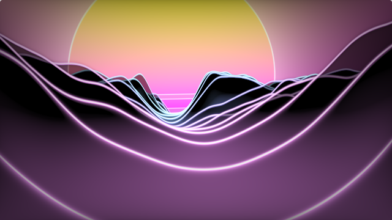</a><br><b>synthwavecanyon</b><br><sub>by <a href="https://www.shadertoy.com/view/slcXW8">mrange</a></sub></td>
<td align="center"><a href="https://www.shadertoy.com/view/sff3RB">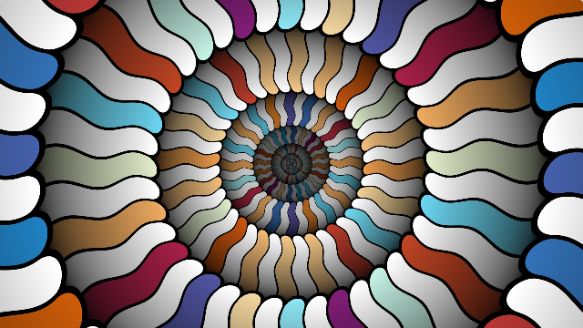</a><br><b>tilewarppt3</b><br><sub>by <a href="https://www.shadertoy.com/view/sff3RB">byt3_m3chanic</a></sub></td>
</tr>
<tr>
<td align="center"><a href="https://www.shadertoy.com/view/NcjGDh">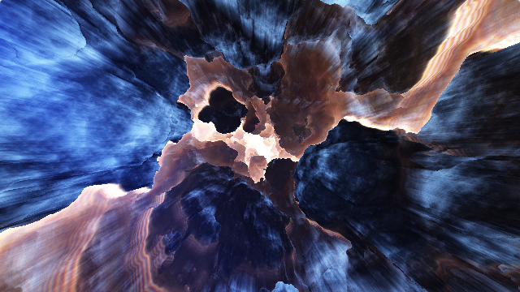</a><br><b>tumblerock</b><br><sub>by <a href="https://www.shadertoy.com/view/NcjGDh">diatribes</a></sub></td>
<td align="center"><a href="https://www.shadertoy.com/view/332XWd">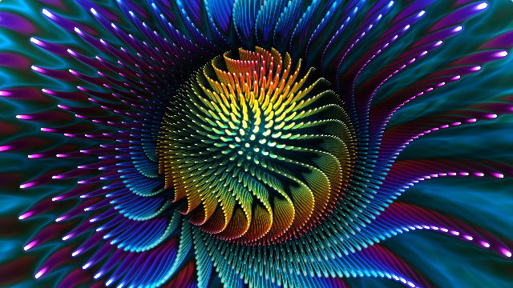</a><br><b>undulatingurchin</b><br><sub>by <a href="https://www.shadertoy.com/view/332XWd">ChunderFPV</a></sub></td>
<td align="center"><a href="https://www.shadertoy.com/view/WdlyRS"></a><br><b>voronoigradient</b><br><sub>by <a href="https://www.shadertoy.com/view/WdlyRS">gls9102</a></sub></td>
<td align="center"><a href="https://www.shadertoy.com/view/fd3fD2"></a><br><b>wadongmo759</b><br><sub>by <a href="https://www.shadertoy.com/view/fd3fD2">dongmo</a></sub></td>
</tr>
<tr>
<td align="center"><a href="https://www.shadertoy.com/view/NtKGWw">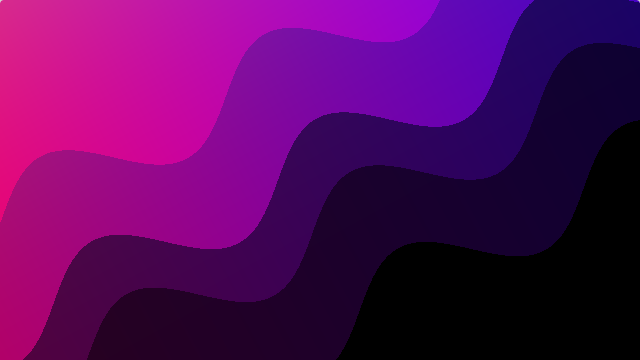</a><br><b>waveymc</b><br><sub>by <a href="https://www.shadertoy.com/view/NtKGWw">feresr</a></sub></td>
<td></td>
<td></td>
<td></td>
</tr>
</table>

> All shaders are sourced from [ShaderToy](https://www.shadertoy.com). Thanks to all the talented shader artists!
>
> 所有着色器均来自 [ShaderToy](https://www.shadertoy.com)，感谢所有才华横溢的着色器艺术家！

---

## English

### Features

- **Cross-Platform** — Windows, Linux (Wayland) and macOS
- **Multi-Monitor** — Apply to all displays or target specific ones
- **Local File Support** — Built-in HTTP server for local HTML/JS/CSS projects
- **ShaderToy Integration** — Automatically converts ShaderToy URLs to fullscreen embed format
- **Local `.shader` Support** — Wrap single-pass ShaderToy snippets into a fullscreen WebGL runtime
- **iChannel Textures** — Supply 2D textures (`.png`/`.jpg`) and 3D volume textures (`.bin`) for ShaderToy shaders that use `iChannel0`–`iChannel3`
- **37 Built-in Shaders** — Curated collection of ShaderToy shaders with pre-tuned parameters, ready to use with `-b <name>`
- **IPC Control** — Stop wallpapers remotely via named pipes (Windows) or Unix domain sockets (Linux/macOS)
- **Graceful Shutdown** — Ctrl+C handling with platform-specific cleanup

### Platform Details

| Platform | Technique | WebView Backend |
|----------|-----------|-----------------|
| Windows | WorkerW desktop embedding | WebView2 (Edge) |
| Linux | GTK layer-shell background surface | WebKitGTK |
| macOS | NSWindow desktop-level ordering | WKWebView |

### Requirements

- **Windows** — Windows 10 (April 2018+) or Windows 11; WebView2 Runtime (usually pre-installed)
- **Linux** — Wayland session with layer-shell support (e.g. Hyprland); GTK 3, WebKitGTK, gtk-layer-shell
- **macOS** — macOS 10.10+; no additional dependencies (WKWebView is a system framework)

### Installation

```bash
git clone https://github.com/user/webwallpaper.git
cd webwallpaper

# Linux dependencies (Debian/Ubuntu)
sudo apt install libgtk-3-dev libwebkit2gtk-4.1-dev libgtk-layer-shell-dev

cargo build --release
# Binary: target/release/webwallpaper(.exe)
```

### Usage

```bash
# URL as wallpaper (all monitors)
webwallpaper https://example.com/wallpaper.html

# Target a specific monitor (0-based index)
webwallpaper https://example.com --display 0

# ShaderToy (auto-converted to fullscreen embed)
webwallpaper "https://www.shadertoy.com/view/tlVGDt"

# Local ShaderToy-style shader with default full-resolution rendering
webwallpaper ./octagrams.shader

# Lower shader render scale for better performance
webwallpaper ./octagrams.shader --scale 0.5

# Slow down shader animation without changing shader source
webwallpaper ./octagrams.shader --time-scale 0.5

# Speed up shader animation for comparison or debugging
webwallpaper ./octagrams.shader --time-scale 2.0

# Shader with iChannel textures (2D png/jpg or 3D .bin volume)
webwallpaper ./clouds.shader --channel0 textures/noise_rgba.png --channel1 textures/noise_grey.png --channel2 textures/noise_volume.bin

# Short aliases for channel and time-scale options
webwallpaper ./clouds.shader --c0 textures/noise_rgba.png --c1 textures/noise_grey.png --ts 0.5

# Use a built-in shader (no files needed)
webwallpaper -b starnest

# List all available built-in shaders
webwallpaper -b list

# Override built-in defaults
webwallpaper -b clouds -s 1.0 --ts 0.5

# Local HTML file
webwallpaper ./my-wallpaper/index.html

# Directory containing index.html
webwallpaper ./my-wallpaper/

# Custom HTTP server port
webwallpaper ./wallpaper.html --port 9000

# Stop wallpaper on display 0
webwallpaper --stop 0

# Stop all wallpapers
webwallpaper --stopall
webwallpaper --sa

# Verbose output
webwallpaper --verbose https://example.com
```

### Command Line Options

| Option | Short | Description |
|--------|-------|-------------|
| `--builtin <NAME>` | `-b` | Use a built-in shader by name (use `list` to see all) |
| `--display <N>` | `-d` | Target specific display (0-based index) |
| `--stop <N>` | | Stop wallpaper on display N |
| `--stopall` | `--sa` | Stop all running wallpapers |
| `--port <PORT>` | `-p` | HTTP server port for local files (default: 8080) |
| `--scale <FACTOR>` | `-s` | Shader render scale (default: 1.0, or per-shader default with `-b`) |
| `--time-scale <FACTOR>` | `--ts` | Shader animation time scale (default: 1.0, or per-shader default with `-b`) |
| `--channel0 <FILE>` | `--c0` | Texture file for iChannel0 (2D image or 3D `.bin` volume) |
| `--channel1 <FILE>` | `--c1` | Texture file for iChannel1 |
| `--channel2 <FILE>` | `--c2` | Texture file for iChannel2 |
| `--channel3 <FILE>` | `--c3` | Texture file for iChannel3 |
| `--verbose` | `-v` | Enable verbose output |
| `--help` | `-h` | Show help message |
| `--version` | `-V` | Show version |

### Shader Tuning

- `--scale` changes render resolution for local `.shader` inputs. Lower values usually improve performance at the cost of sharpness.
- `--time-scale` changes the speed of the injected `iTime` and `iTimeDelta` values for local `.shader` inputs.
- Use `--time-scale 1.0` for original speed, values below `1.0` to slow animation down, values above `1.0` to speed it up, and `0` to freeze time for debugging.
- `--time-scale` avoids editing shader source when you only want to compare animation pacing across different shaders.

### iChannel Textures

Many ShaderToy shaders read from `iChannel0`–`iChannel3` for noise, photos, or other data. You can supply these textures from local files:

- **2D textures** — any image format (`.png`, `.jpg`, etc.) → declared as `sampler2D`
- **3D volume textures** — ShaderToy `.bin` format (header: 4-byte signature + width/height/depth/channels, followed by raw uint8 data) → declared as `sampler3D`

The file extension determines the type: `.bin` = 3D volume, anything else = 2D texture.

Channels that are not provided are automatically declared. If the shader fails to compile with `sampler2D`, the engine retries with `sampler3D` — so most shaders work without any `--channel` flags, albeit with blank (black) texture reads.

To find a ShaderToy shader's iChannel configuration, open the shader page in a browser and run this in DevTools (F12) Console:

```javascript
JSON.stringify(gShaderToy.mEffect.mPasses.map((pass, pi) => ({
  pass: pi, type: pass.mType,
  inputs: pass.mInputs.map((inp, i) => inp ? {
    channel: i, type: inp.mInfo.mType, src: inp.mInfo.mSrc
  } : null).filter(x => x)
})), null, 2)
```

Then download the textures from `https://www.shadertoy.com<src_path>` in your browser.

### Built-in Shaders

The binary ships with 37 curated shaders and their required textures — no external files needed:

```bash
webwallpaper -b list        # see all available names
webwallpaper -b starnest    # use it
```

Each built-in shader has pre-tuned `scale` and `time_scale` defaults (configured in `builtins.json`) optimized for desktop wallpaper use. You can override any default with CLI flags:

```bash
webwallpaper -b clouds -s 1.0 --ts 0.5
```

### Credits

The built-in shaders are sourced from [ShaderToy](https://www.shadertoy.com). We are grateful to the talented shader artists who created and shared these works:

| Shader | Author | ShaderToy |
|--------|--------|-----------|
| 2dclouds | drift | [4tdSWr](https://www.shadertoy.com/view/4tdSWr) |
| accretion | Xor | [WcKXDV](https://www.shadertoy.com/view/WcKXDV) |
| ascend | bug | [33KBDm](https://www.shadertoy.com/view/33KBDm) |
| auroras | nimitz | [XtGGRt](https://www.shadertoy.com/view/XtGGRt) |
| chillywave | Tornax07 | [3XSBDW](https://www.shadertoy.com/view/3XSBDW) |
| chillywave2 | Tornax07 | [NflGRM](https://www.shadertoy.com/view/NflGRM) |
| classic4colors | zosxavius | [W3K3zy](https://www.shadertoy.com/view/W3K3zy) |
| clouds | iq | [XslGRr](https://www.shadertoy.com/view/XslGRr) |
| crumpledwave | nasana | [3ttSzr](https://www.shadertoy.com/view/3ttSzr) |
| darktransit | diatribes | [WcdczB](https://www.shadertoy.com/view/WcdczB) |
| forknixietubeclock | picoplanetdev | [Dds3WB](https://www.shadertoy.com/view/Dds3WB) |
| hexagonalgrid | iq | [WtSfWK](https://www.shadertoy.com/view/WtSfWK) |
| hexneonlove | tutmann | [3tKSWV](https://www.shadertoy.com/view/3tKSWV) |
| hieroglyphs | nayk | [Nff3Ds](https://www.shadertoy.com/view/Nff3Ds) |
| iceandfire | mattz | [MdfBzl](https://www.shadertoy.com/view/MdfBzl) |
| linuxwallpaper | movAX13h | [4dcGRn](https://www.shadertoy.com/view/4dcGRn) |
| mandelbrot | JennySchub | [NlcSRj](https://www.shadertoy.com/view/NlcSRj) |
| montereywannabe | mrange | [NdVfzK](https://www.shadertoy.com/view/NdVfzK) |
| patternminimax | PAEz | [sfS3Dz](https://www.shadertoy.com/view/sfS3Dz) |
| pinkvoid | iVader | [ddKXWh](https://www.shadertoy.com/view/ddKXWh) |
| plasma | Xor | [WfS3Dd](https://www.shadertoy.com/view/WfS3Dd) |
| plasmawaves | scarletshark | [ltXczj](https://www.shadertoy.com/view/ltXczj) |
| polyhedrons | yli110 | [sc2GzW](https://www.shadertoy.com/view/sc2GzW) |
| proteanclouds | nimitz | [3l23Rh](https://www.shadertoy.com/view/3l23Rh) |
| ps3xmb | llmciv | [fcf3Dn](https://www.shadertoy.com/view/fcf3Dn) |
| seventymelt | tomorrowevening | [XsX3zl](https://www.shadertoy.com/view/XsX3zl) |
| singularity | Xor | [3csSWB](https://www.shadertoy.com/view/3csSWB) |
| spiralgalaxy | mrange | [wsBBWD](https://www.shadertoy.com/view/wsBBWD) |
| starnest | Kali | [XlfGRj](https://www.shadertoy.com/view/XlfGRj) |
| starshipreentry | negentrope | [XX3fDH](https://www.shadertoy.com/view/XX3fDH) |
| synthwavecanyon | mrange | [slcXW8](https://www.shadertoy.com/view/slcXW8) |
| tilewarppt3 | byt3_m3chanic | [sff3RB](https://www.shadertoy.com/view/sff3RB) |
| tumblerock | diatribes | [NcjGDh](https://www.shadertoy.com/view/NcjGDh) |
| undulatingurchin | ChunderFPV | [332XWd](https://www.shadertoy.com/view/332XWd) |
| voronoigradient | gls9102 | [WdlyRS](https://www.shadertoy.com/view/WdlyRS) |
| wadongmo759 | dongmo | [fd3fD2](https://www.shadertoy.com/view/fd3fD2) |
| waveymc | feresr | [NtKGWw](https://www.shadertoy.com/view/NtKGWw) |

### Troubleshooting

- **WebView2 not available (Windows)** — Install from [Microsoft](https://developer.microsoft.com/microsoft-edge/webview2/)
- **Layer-shell not available (Linux)** — Ensure you are on a Wayland session with a layer-shell compositor (e.g. Hyprland), and install `libgtk-3-dev libwebkit2gtk-4.1-dev libgtk-layer-shell-dev`
- **Port already in use** — Use `--port 9000` to pick a different port
- **Shader performance is poor** — Use `--scale 0.5` or `--scale 0.75` for `.shader` inputs
- **Finding display numbers** — Run with `--verbose` to list detected displays

### Architecture

```
src/
├── main.rs           # Entry point, CLI dispatch, URL transformation
├── builtin.rs        # 37 embedded shaders & textures, built-in shader extraction
├── cli.rs            # Argument parsing (clap)
├── config.rs         # Configuration and instance tracking
├── shader.rs         # Shader file support, iChannel textures, WebGL runtime generation
├── server.rs         # Local HTTP server (tiny_http)
├── ipc.rs            # IPC (named pipes / Unix sockets)
├── display.rs        # Shared monitor data model
├── wallpaper.rs      # Shared wallpaper config / errors
└── platform/
    ├── windows/      # WorkerW technique + WebView2
    ├── linux/        # GTK layer-shell + WebKitGTK
    └── macos/        # NSWindow desktop-level + WKWebView
```

### License

MIT

---

## 中文

### 功能特性

- **跨平台** — 支持 Windows、Linux (Wayland) 和 macOS
- **多显示器** — 应用到所有显示器或指定特定显示器
- **本地文件支持** — 内置 HTTP 服务器，支持本地 HTML/JS/CSS 项目
- **ShaderToy 集成** — 自动将 ShaderToy URL 转换为全屏嵌入格式
- **本地 `.shader` 支持** — 将单文件 ShaderToy 片段包装成全屏 WebGL 运行时
- **iChannel 纹理** — 为使用 `iChannel0`–`iChannel3` 的 ShaderToy 着色器提供 2D 纹理（`.png`/`.jpg`）和 3D 体积纹理（`.bin`）
- **37 款内置着色器** — 精选 ShaderToy 着色器合集，预调参数，通过 `-b <名称>` 即可开箱即用
- **IPC 控制** — 通过命名管道 (Windows) 或 Unix Domain Socket (Linux/macOS) 远程停止壁纸
- **优雅关闭** — Ctrl+C 处理并执行平台相关清理

### 平台实现

| 平台 | 技术方案 | WebView 后端 |
|------|----------|-------------|
| Windows | WorkerW 桌面嵌入 | WebView2 (Edge) |
| Linux | GTK layer-shell 背景层 | WebKitGTK |
| macOS | NSWindow 桌面层级窗口 | WKWebView |

### 系统要求

- **Windows** — Windows 10 (2018年4月更新+) 或 Windows 11；WebView2 运行时（通常已预装）
- **Linux** — 支持 layer-shell 的 Wayland 会话（如 Hyprland）；GTK 3、WebKitGTK、gtk-layer-shell
- **macOS** — macOS 10.10+；无额外依赖（WKWebView 为系统框架）

### 安装

```bash
git clone https://github.com/user/webwallpaper.git
cd webwallpaper

# Linux 依赖（Debian/Ubuntu 系）
sudo apt install libgtk-3-dev libwebkit2gtk-4.1-dev libgtk-layer-shell-dev

cargo build --release
# 二进制文件：target/release/webwallpaper(.exe)
```

### 使用方法

```bash
# 将 URL 设为壁纸（所有显示器）
webwallpaper https://example.com/wallpaper.html

# 指定显示器（从 0 开始的索引）
webwallpaper https://example.com --display 0

# ShaderToy（自动转换为全屏嵌入格式）
webwallpaper "https://www.shadertoy.com/view/tlVGDt"

# 本地 ShaderToy 风格着色器
webwallpaper ./octagrams.shader

# 降低渲染缩放以提升性能
webwallpaper ./octagrams.shader --scale 0.5

# 不修改 shader 源码，直接放慢动画速度
webwallpaper ./octagrams.shader --time-scale 0.5

# 加快动画速度，便于对比或调试
webwallpaper ./octagrams.shader --time-scale 2.0

# 带 iChannel 纹理的 Shader（2D png/jpg 或 3D .bin 体积纹理）
webwallpaper ./clouds.shader --channel0 textures/noise_rgba.png --channel1 textures/noise_grey.png --channel2 textures/noise_volume.bin

# 使用简短别名
webwallpaper ./clouds.shader --c0 textures/noise_rgba.png --c1 textures/noise_grey.png --ts 0.5

# 使用内置着色器（无需任何文件）
webwallpaper -b starnest

# 列出所有可用的内置着色器
webwallpaper -b list

# 覆盖内置默认参数
webwallpaper -b clouds -s 1.0 --ts 0.5

# 本地 HTML 文件
webwallpaper ./my-wallpaper/index.html

# 包含 index.html 的目录
webwallpaper ./my-wallpaper/

# 自定义 HTTP 服务器端口
webwallpaper ./wallpaper.html --port 9000

# 停止显示器 0 上的壁纸
webwallpaper --stop 0

# 停止所有壁纸
webwallpaper --stopall
webwallpaper --sa

# 详细输出
webwallpaper --verbose https://example.com
```

### 命令行选项

| 选项 | 简写 | 描述 |
|------|------|------|
| `--builtin <NAME>` | `-b` | 使用内置着色器（`list` 查看全部） |
| `--display <N>` | `-d` | 指定目标显示器（从 0 开始的索引） |
| `--stop <N>` | | 停止显示器 N 上的壁纸 |
| `--stopall` | `--sa` | 停止所有运行中的壁纸 |
| `--port <PORT>` | `-p` | 本地文件 HTTP 服务器端口（默认：8080） |
| `--scale <FACTOR>` | `-s` | 渲染缩放（默认：1.0，使用 `-b` 时按内置配置） |
| `--time-scale <FACTOR>` | `--ts` | 动画时间缩放（默认：1.0，使用 `-b` 时按内置配置） |
| `--channel0 <FILE>` | `--c0` | iChannel0 纹理文件（2D 图片或 3D `.bin` 体积纹理） |
| `--channel1 <FILE>` | `--c1` | iChannel1 纹理文件 |
| `--channel2 <FILE>` | `--c2` | iChannel2 纹理文件 |
| `--channel3 <FILE>` | `--c3` | iChannel3 纹理文件 |
| `--verbose` | `-v` | 启用详细输出 |
| `--help` | `-h` | 显示帮助信息 |
| `--version` | `-V` | 显示版本信息 |

### Shader 调节

- `--scale` 用于调整本地 `.shader` 输入的渲染分辨率；值越小通常性能越好，但画面会更模糊。
- `--time-scale` 用于调整本地 `.shader` 输入注入的 `iTime` 和 `iTimeDelta` 速度。
- `--time-scale 1.0` 表示原始速度，小于 `1.0` 表示减速，大于 `1.0` 表示加速，`0` 可用于冻结时间以便调试。
- 当你只是想对比不同 shader 的动画节奏时，`--time-scale` 可以避免逐个修改 shader 源码。

### iChannel 纹理

许多 ShaderToy 着色器通过 `iChannel0`–`iChannel3` 读取噪声、照片或其他数据。你可以通过本地文件提供这些纹理：

- **2D 纹理** — 任意图片格式（`.png`、`.jpg` 等）→ 声明为 `sampler2D`
- **3D 体积纹理** — ShaderToy `.bin` 格式（文件头：4 字节签名 + 宽/高/深/通道数，后接 uint8 原始数据）→ 声明为 `sampler3D`

文件扩展名决定类型：`.bin` = 3D 体积纹理，其他 = 2D 纹理。

未提供的通道会自动声明。如果以 `sampler2D` 编译失败，引擎会自动重试 `sampler3D`——因此大多数着色器无需任何 `--channel` 参数即可运行，只是未绑定的纹理读取结果为黑色。

要查看某个 ShaderToy 着色器的 iChannel 配置，在浏览器中打开该着色器页面，在开发者工具（F12）控制台中执行：

```javascript
JSON.stringify(gShaderToy.mEffect.mPasses.map((pass, pi) => ({
  pass: pi, type: pass.mType,
  inputs: pass.mInputs.map((inp, i) => inp ? {
    channel: i, type: inp.mInfo.mType, src: inp.mInfo.mSrc
  } : null).filter(x => x)
})), null, 2)
```

然后在浏览器中从 `https://www.shadertoy.com<src路径>` 下载对应的纹理文件。

### 内置着色器

程序内嵌了 37 款精选着色器及其所需纹理，无需任何外部文件即可使用：

```bash
webwallpaper -b list        # 查看所有可用名称
webwallpaper -b starnest    # 直接使用
```

每款内置着色器都有预调的 `scale` 和 `time_scale` 默认值（配置在 `builtins.json` 中），针对桌面壁纸场景优化。你可以通过命令行参数覆盖任意默认值：

```bash
webwallpaper -b clouds -s 1.0 --ts 0.5
```

### 致谢

内置着色器来源于 [ShaderToy](https://www.shadertoy.com)。感谢才华横溢的着色器艺术家们创作并分享了这些精彩的作品：

| 着色器 | 作者 | ShaderToy |
|--------|------|-----------|
| 2dclouds | drift | [4tdSWr](https://www.shadertoy.com/view/4tdSWr) |
| accretion | Xor | [WcKXDV](https://www.shadertoy.com/view/WcKXDV) |
| ascend | bug | [33KBDm](https://www.shadertoy.com/view/33KBDm) |
| auroras | nimitz | [XtGGRt](https://www.shadertoy.com/view/XtGGRt) |
| chillywave | Tornax07 | [3XSBDW](https://www.shadertoy.com/view/3XSBDW) |
| chillywave2 | Tornax07 | [NflGRM](https://www.shadertoy.com/view/NflGRM) |
| classic4colors | zosxavius | [W3K3zy](https://www.shadertoy.com/view/W3K3zy) |
| clouds | iq | [XslGRr](https://www.shadertoy.com/view/XslGRr) |
| crumpledwave | nasana | [3ttSzr](https://www.shadertoy.com/view/3ttSzr) |
| darktransit | diatribes | [WcdczB](https://www.shadertoy.com/view/WcdczB) |
| forknixietubeclock | picoplanetdev | [Dds3WB](https://www.shadertoy.com/view/Dds3WB) |
| hexagonalgrid | iq | [WtSfWK](https://www.shadertoy.com/view/WtSfWK) |
| hexneonlove | tutmann | [3tKSWV](https://www.shadertoy.com/view/3tKSWV) |
| hieroglyphs | nayk | [Nff3Ds](https://www.shadertoy.com/view/Nff3Ds) |
| iceandfire | mattz | [MdfBzl](https://www.shadertoy.com/view/MdfBzl) |
| linuxwallpaper | movAX13h | [4dcGRn](https://www.shadertoy.com/view/4dcGRn) |
| mandelbrot | JennySchub | [NlcSRj](https://www.shadertoy.com/view/NlcSRj) |
| montereywannabe | mrange | [NdVfzK](https://www.shadertoy.com/view/NdVfzK) |
| patternminimax | PAEz | [sfS3Dz](https://www.shadertoy.com/view/sfS3Dz) |
| pinkvoid | iVader | [ddKXWh](https://www.shadertoy.com/view/ddKXWh) |
| plasma | Xor | [WfS3Dd](https://www.shadertoy.com/view/WfS3Dd) |
| plasmawaves | scarletshark | [ltXczj](https://www.shadertoy.com/view/ltXczj) |
| polyhedrons | yli110 | [sc2GzW](https://www.shadertoy.com/view/sc2GzW) |
| proteanclouds | nimitz | [3l23Rh](https://www.shadertoy.com/view/3l23Rh) |
| ps3xmb | llmciv | [fcf3Dn](https://www.shadertoy.com/view/fcf3Dn) |
| seventymelt | tomorrowevening | [XsX3zl](https://www.shadertoy.com/view/XsX3zl) |
| singularity | Xor | [3csSWB](https://www.shadertoy.com/view/3csSWB) |
| spiralgalaxy | mrange | [wsBBWD](https://www.shadertoy.com/view/wsBBWD) |
| starnest | Kali | [XlfGRj](https://www.shadertoy.com/view/XlfGRj) |
| starshipreentry | negentrope | [XX3fDH](https://www.shadertoy.com/view/XX3fDH) |
| synthwavecanyon | mrange | [slcXW8](https://www.shadertoy.com/view/slcXW8) |
| tilewarppt3 | byt3_m3chanic | [sff3RB](https://www.shadertoy.com/view/sff3RB) |
| tumblerock | diatribes | [NcjGDh](https://www.shadertoy.com/view/NcjGDh) |
| undulatingurchin | ChunderFPV | [332XWd](https://www.shadertoy.com/view/332XWd) |
| voronoigradient | gls9102 | [WdlyRS](https://www.shadertoy.com/view/WdlyRS) |
| wadongmo759 | dongmo | [fd3fD2](https://www.shadertoy.com/view/fd3fD2) |
| waveymc | feresr | [NtKGWw](https://www.shadertoy.com/view/NtKGWw) |

### 故障排除

- **WebView2 不可用 (Windows)** — 从 [Microsoft](https://developer.microsoft.com/microsoft-edge/webview2/) 安装
- **Layer-shell 不可用 (Linux)** — 确认在支持 layer-shell 的 Wayland 会话中运行（如 Hyprland），并安装 `libgtk-3-dev libwebkit2gtk-4.1-dev libgtk-layer-shell-dev`
- **端口被占用** — 使用 `--port 9000` 指定其他端口
- **Shader 性能较差** — 对 `.shader` 输入使用 `--scale 0.5` 或 `--scale 0.75`
- **查找显示器编号** — 使用 `--verbose` 运行以查看检测到的显示器

### 项目结构

```
src/
├── main.rs           # 入口点、CLI 分发、URL 转换
├── cli.rs            # 参数解析 (clap)
├── config.rs         # 配置和实例跟踪
├── shader.rs         # Shader 文件支持、iChannel 纹理、WebGL 运行时生成
├── server.rs         # 本地 HTTP 服务器 (tiny_http)
├── ipc.rs            # 进程间通信（命名管道 / Unix Socket）
├── display.rs        # 共享显示器数据模型
├── wallpaper.rs      # 共享壁纸配置与错误类型
└── platform/
    ├── windows/      # WorkerW 技术 + WebView2
    ├── linux/        # GTK layer-shell + WebKitGTK
    └── macos/        # NSWindow 桌面层级 + WKWebView
```

### 许可证

MIT
